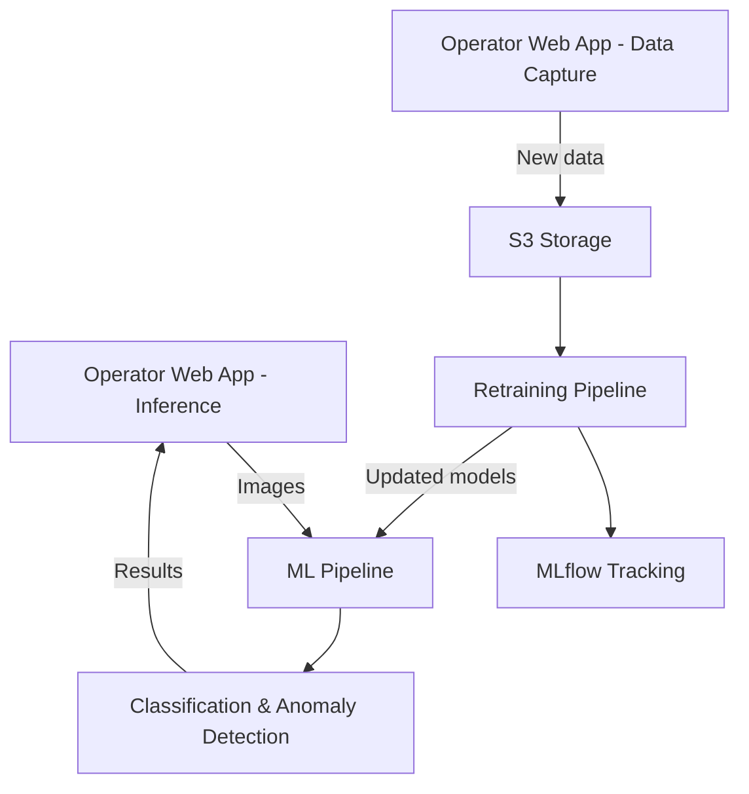

# MLOps Precision Lens 🔍
Precision Lens is an end to end MLOps project for image anomaly detection in a manufacturing setting. 🏭

On the inference side, it utilizes an ML pipeline to classify an image as a particular product/part, and then selects a pre-trained model to detect anomalies in the image.

On the training side, new data captured from the manufacturing line is used to retrain the classification model and the anomaly detection models automatically.

The focus of this project is to provide a robust and scalable solution for image classification and anomaly detection in a production environment, leveraging modern MLOps practices. ⚙️ Ease of use, quality data collection, automation, auditability, and scalability are key design principles.



## Features ✨
- **Image Classification** 📸: Classifies images into different product categories.
- **Anomaly Detection** 🔍: Creates individual models for each product/part class.
- **Automated Retraining** 🔄: Automatically retrains models with new data.
- **Kubernetes Deployment** ☸️: Deploys the application on a Kubernetes cluster.
- **S3 Storage** 📦: Stores data and model artifacts in Amazon S3.
- **MLflow Tracking** 📊: Logs experiments, models, and metrics using MLflow.
- **Operator Web App** 🖥️: Provides a simple web interface for production line operators to inspect parts with the anomaly detection system, as well as capturing new data for retraining.


## Upcoming Features 🚀
- **Human-in-the-loop** 👥: Integrate human feedback to confirm data quality and labeling.
- **Model Drift Detection** 📈: Monitor model performance and detect drift over time.

## Project Structure 📁
- **apps/inspection-app**: Contains the code for the operator web app (Plotly Dash).
- **infrastructure/**: Terraform IaC for deploying the complete stack to a Kubernetes cluster.
- **models/**: Contains the model training and inference code.
- **pipelines/**: Contains the ML pipelines for automated training. (Apache Airflow))

**See the project folders for additional details and documentation on each component.**

## Getting Started

### Prerequisites
- A Kubernetes cluster
- kubectl command-line tool
- Helm package manager
- Terraform command-line tool

### Local Setup Instructions
1. **Clone the repository**:
    ```bash
    git clone https://github.com/spencershepard/MLOps-Precision-Lens.git
    cd MLOps-Precision-Lens
    cp secrets.env.example secrets.env
    ```
2. **Configure your secrets/config**:
   - Update `secrets.env` with your AWS credentials and other necessary secrets.
   - Update `config.env` with your desired configuration settings.

3. **Deploy the infrastructure**:
   - Navigate to the `infrastructure/terraform` directory.
   - Run the following command to deploy the infrastructure:
     ```bash
     terraform init
     terraform apply
     ```

4. **Setup Hostnames**:
   - Update your `/etc/hosts` on linux, or run [infrastructure\scripts\setup-local-domains.ps1](infrastructure/scripts/setup-local-domains.ps1) on Windows.

5. **Add the first model**
   In MLFLow, create a new model for each product/part class you want to detect anomalies for. 

## Access the Application
Once the infrastructure is deployed and the hostname is set up, you can access the application at:

http://precision-lens.local

- MLFlow UI: http://mlflow.local
- Airflow UI: http://airflow.local default credentials are `admin/admin`.
- Grafana UI: http://grafana.local with the default credentials `admin/promoperator`.